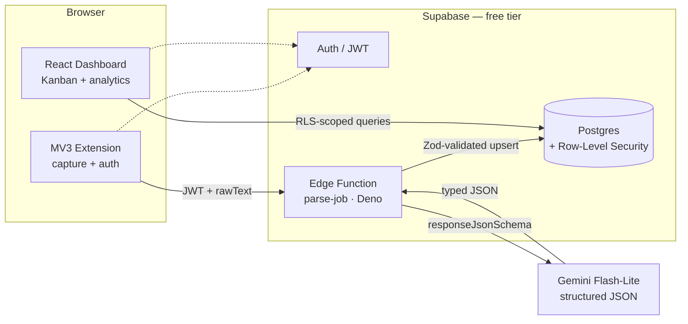

<div align="center">

# 🎯 Job Funnel

**Save any job posting from your browser, let AI structure it, and track your search as a data pipeline — not a spreadsheet.**

A full-stack personal tool: a browser extension captures listings, a Gemini-powered
edge function parses them into typed data, and a Kanban dashboard turns your
applications into a searchable, analyzable funnel.


</div>

---

## The problem

Job hunting is a numbers game spread across disconnected platforms — LinkedIn,
Indeed, Wellfound, company sites. You copy-paste into spreadsheets, lose track of
where you applied, and never see the *patterns*: which skills keep coming up, who's
hiring most, how much of your funnel is actually remote.

**Job Funnel** collapses that into one loop: **capture → parse → manage → analyze.**

## What it does

- **One-click capture** — a browser extension grabs the job text + URL from the
  active tab (or your text selection) and sends it to the backend. No copy-paste.
- **AI structuring** — Gemini extracts clean, typed fields (company, title, skills,
  experience, location, work arrangement) with a strict JSON schema, so messy
  postings become queryable rows.
- **Kanban pipeline** — drag applications across `Saved → Applied → Interviewing →
  Offer → Rejected / Archived`; fix any AI mistake in a modal.
- **Personal funnel analytics** — skill-frequency chart, top-hiring-companies
  leaderboard, remote/hybrid/onsite split, and country clusters — over *your own*
  saved jobs.
- **Runs at $0** — client-side capture uses your own logged-in browser session, so
  there are no proxies or anti-bot services to pay for. Every tier is free.

## Screenshots

> _Coming soon — dashboard board, analytics tab, and the capture popup._
> _(Drop images in `docs/screenshots/` and link them here.)_

## Architecture



**Data flow:** the extension captures page text → POSTs it with the user's JWT to
the edge function → the function calls Gemini with a strict response schema →
re-validates the result with Zod → upserts a row scoped to the user → the dashboard
reads it back under Row-Level Security.

## Engineering highlights

The parts I'm most happy with — the decisions that make this more than a CRUD app:

- **🔒 Multi-tenant isolation by the database, not the app.** Every table access is
  gated by Postgres **Row-Level Security** (`user_id = auth.uid()`), verified by a
  dedicated SQL test that proves one user can't read or mutate another's rows. The
  client never filters by user — it *can't* leak data.
- **🧩 Type-safe LLM output.** Zod v4 schema → `z.toJSONSchema()` → Gemini's
  `responseJsonSchema` → **re-validated with Zod** so transforms (lowercasing,
  trimming, clamping) actually run. The model is forced to emit valid JSON, then
  proven valid before it touches the DB.
- **📐 One schema, three runtimes.** A single `packages/shared` Zod contract is the
  source of truth for the React apps *and* the Deno edge function — kept in sync by
  a generate-and-drift-check script, since the Edge Runtime only bundles its own
  folder.
- **🛡️ Resilient parsing.** A parse failure never loses the scrape: it lands as a
  `needs_review` row with the raw text retained. The model id is env-overridable —
  which already saved me once when Google retired the pinned model mid-project.
- **🔑 Secrets stay server-side.** The Gemini key lives only as an edge-function
  secret; the browser authenticates with a Supabase JWT and never sees it.
- **♻️ Idempotent capture.** Re-saving a URL upserts on `(user_id, source_url)` —
  it refreshes parsed fields but preserves your Kanban status.
- **🧪 Tested where it counts.** The edge handler is dependency-injected so its full
  branch matrix (auth failure, bad body, parse-ok, parse-fail, DB failure) is unit-
  tested with **no network** — 21 tests across schema, aggregations, and handler.

## Tech stack

| Layer | Tech |
|:--|:--|
| **Dashboard** | React 19 · TypeScript · Tailwind CSS 4 · Vite 8 · Recharts |
| **Extension** | Manifest V3 · React · `@crxjs/vite-plugin` · `chrome.scripting` |
| **Backend** | Supabase (Postgres + Auth) · Edge Functions (Deno + TypeScript) |
| **Validation** | Zod v4 (shared contract, LLM schema enforcement) |
| **AI** | Google Gemini Flash-Lite (strict structured output) |
| **Tooling** | pnpm workspace · Deno test · `node:test` |

## Getting started

```bash
pnpm install
supabase start          # local Postgres + Auth (needs Docker)
supabase db reset       # apply migrations (jobs table + RLS)

# Backend: add a free Gemini key, then serve the parser
cp supabase/functions/.env.example supabase/functions/.env
supabase functions serve parse-job --env-file supabase/functions/.env

# Dashboard
pnpm --filter @job-analyzer/web dev      # http://localhost:5173
```

Full setup — extension loading, hosted deployment, RLS verification — is in
**[docs/DEVELOPMENT.md](./docs/DEVELOPMENT.md)**.

## Testing

```bash
pnpm test:all     # 21 tests: shared schema + analytics (Node) + edge handler (Deno)
```

| Suite | Covers |
|:--|:--|
| `packages/shared` | Zod validation, transforms, extraction → DB mapping |
| `apps/web` | Analytics aggregations (skill/company/arrangement/geo) |
| `supabase/functions` | parse → validate → persist branch matrix (auth, parse, DB) |

## Project structure

```
job-analyzer/
├─ apps/
│  ├─ web/          React dashboard — Kanban board + analytics
│  └─ extension/    MV3 browser extension — capture + auth
├─ packages/
│  └─ shared/       Canonical Zod schemas & types (source of truth)
├─ supabase/
│  ├─ migrations/   jobs table, enums, indexes, Row-Level Security
│  ├─ functions/    parse-job edge function (Deno) + tests
│  └─ tests/        RLS verification SQL
└─ pnpm-workspace.yaml
```

## Roadmap

**Shipped**

- ✅ Supabase schema + Row-Level Security + shared Zod contract
- ✅ MV3 extension: on-demand capture + Supabase auth
- ✅ Gemini edge function: structured parse + idempotent upsert + `needs_review` fallback
- ✅ Kanban dashboard with drag-to-move + manual-edit modal
- ✅ Personal funnel analytics (recharts)
- ✅ Error boundary + tests on the parse → validate → persist path

**Planned**

- ⏳ Cross-browser extension (Chrome + Firefox) via a [WXT migration](./docs/firefox-support.md)
- ⏳ Dashboard URL-paste ingestion (capture without the extension)
- ⏳ One-command hosted deployment (Supabase + Cloudflare Pages)
- ⏳ Retry-from-`needs_review` and richer manual overrides
- 🔮 _(Future)_ opt-in, anonymized cross-user aggregation for real market-wide
  skill/company trends — with explicit consent and a privacy review

## Cost & privacy

Designed to run at **$0/month** for personal use: Supabase free tier, a static
dashboard host (Cloudflare Pages / Vercel), an unpacked extension, and Gemini's
free API tier. Two conscious trade-offs, documented in the
[PRD](./job_tracker_project_plan.md): the Gemini free tier may use submitted
content for training, and client-side scraping of your own logged-in session sits
in a ToS gray area — acceptable for a personal tool.

---

<div align="center">
<sub>Personal portfolio project · built to actually use, not just to demo.</sub>
</div>
